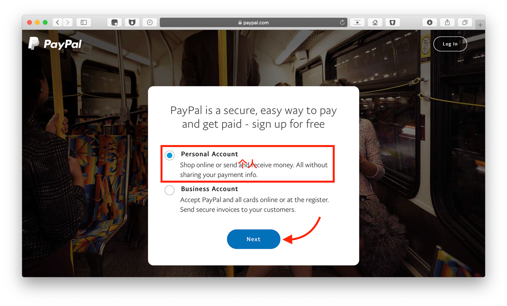
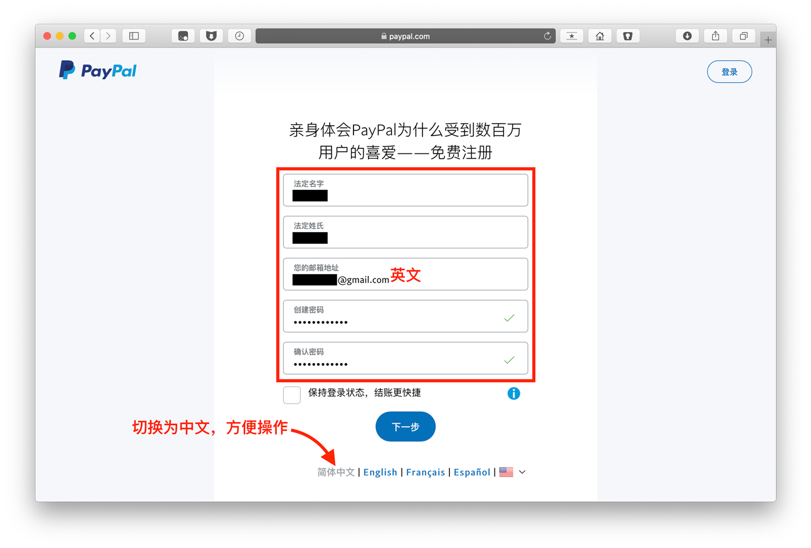
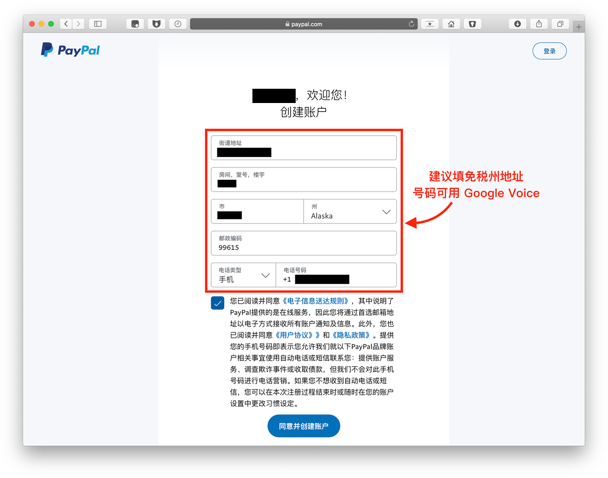
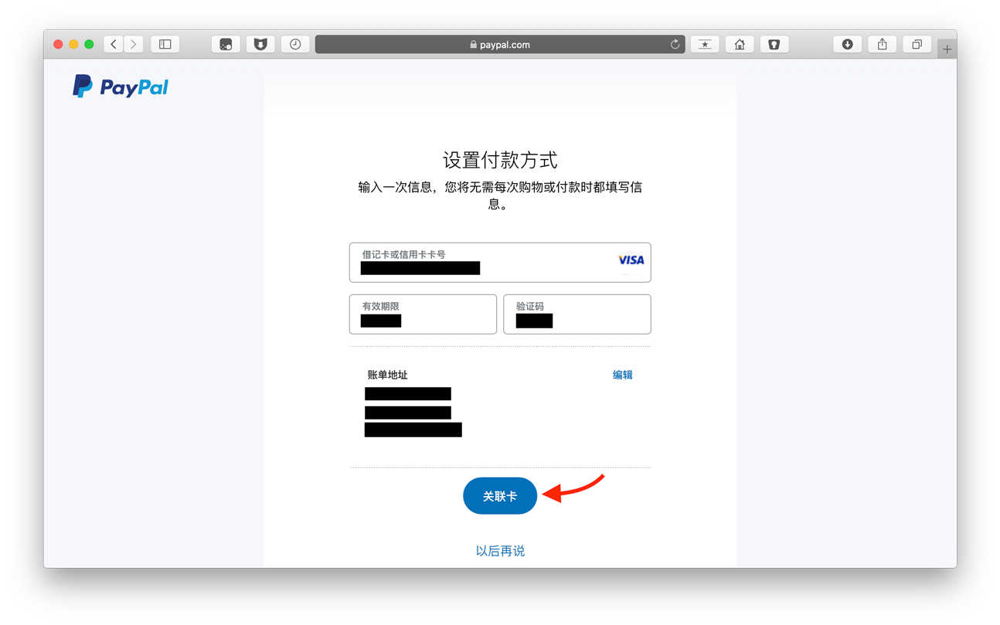
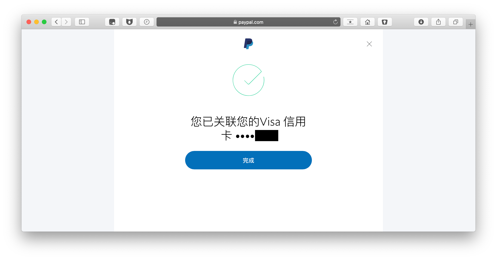
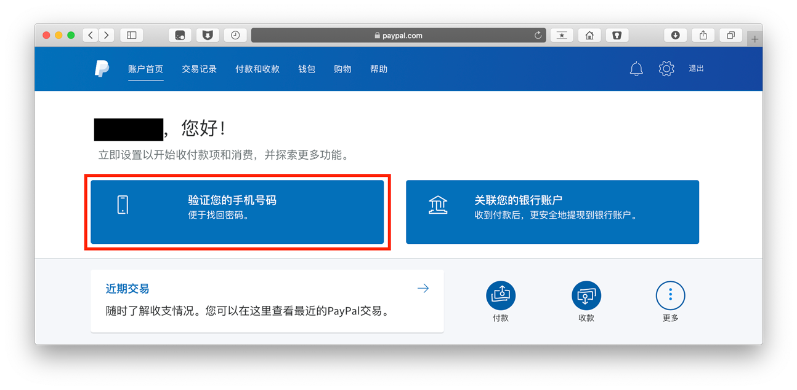
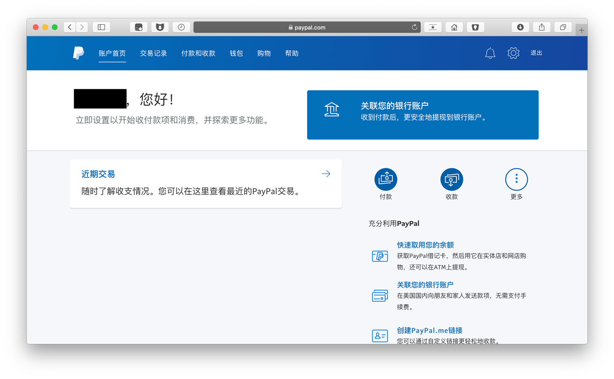
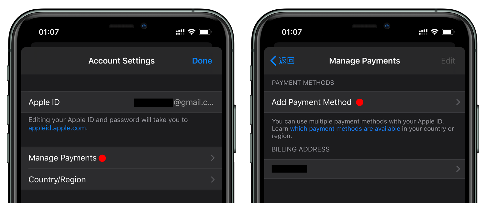
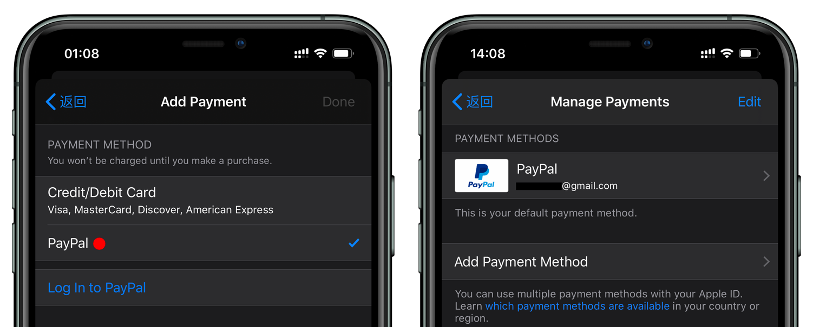
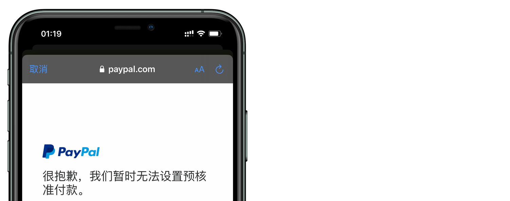

# 使用 Google Voice 注册美区 PayPal，绑定美区 Apple ID 教程

### 步骤一、检查 IP

节点切换为美国（全局模式），浏览器（无痕模式）打开 [whoer](https://whoer.net) 检测路线伪装程度。

【注】部分人 IP 节点虽然是美国，但不是原生 IP。

---

### 步骤二、注册

打开美国 [PayPal](https://www.paypal.com/us/webapps/mpp/home)，点击右上角 `Sign Up` 。选择个人账户，点击「next」。

填写真实姓名、邮箱、密码。

填写美国地址，也可以使用 [美国地址生成器](https://www.fakeaddressgenerator.com/Random_Address/US_California)（建议选择免税州）。手机填写 Google Voice 号码。

点选【同意并创建账户】完成注册。

---

### 步骤三、验证邮箱，绑定银行卡

Gmail 收件箱里找到 Paypal 邮件，点选「验证我的邮箱地址」。填写银行卡信息。

绑定银行卡成功。

---

### 步骤四、验证手机号完成注册

回到 PayPal 首页，点选「验证我的手机号码」。

输入 Google Voice 号码，点击下一步。

将收到的验证码填入并点选「继续」完成绑定。

---

### 步骤五、绑定美区 Apple ID

【注】为防止被[风控](#解决绑定-apple-id-被风控)，建议 2~3 天后再关联美区 Apple ID。

App Store 登陆美区 Apple ID，点按头像进入点选「Manage Payments」管理付款。点选「Add Payment Method」添加付款方式。

点选「PayPal」会打开网页并登陆完成绑定。

【注】PayPal 绑定的银行卡会消费几美元，验证后会返还。

---

### 解决 Paypal 被风控

登陆 PayPal 如出现下图情况，是因新注册的 PayPal 有审核机制，解决办法：

**方法一**：将下图中中文翻译成英文并发邮件给 PayPal，请客服解决。

**方法二**：等 1-2 天再来 App Store 验证。

---

### Telegram

* V2EX群：[https://t.me/V2EXPro](https://t.me/V2EXPro)
* Apple群：[https://t.me/applequn](https://t.me/applequn)
* Google群：[https://t.me/googlequn](https://t.me/googlequn)
