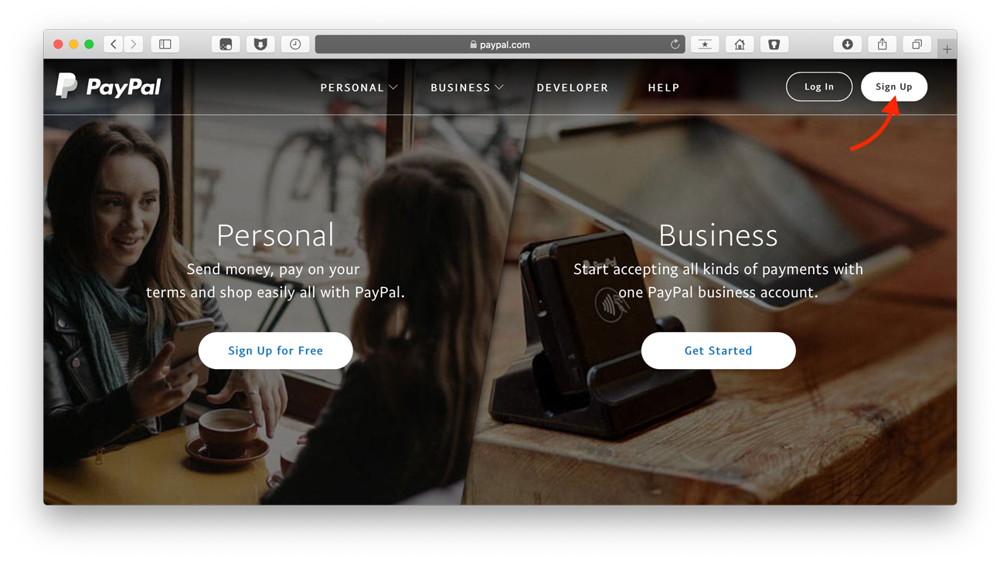
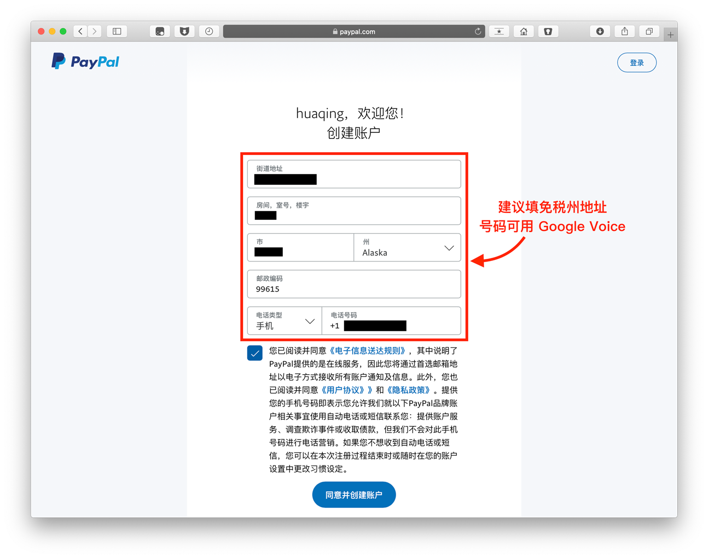
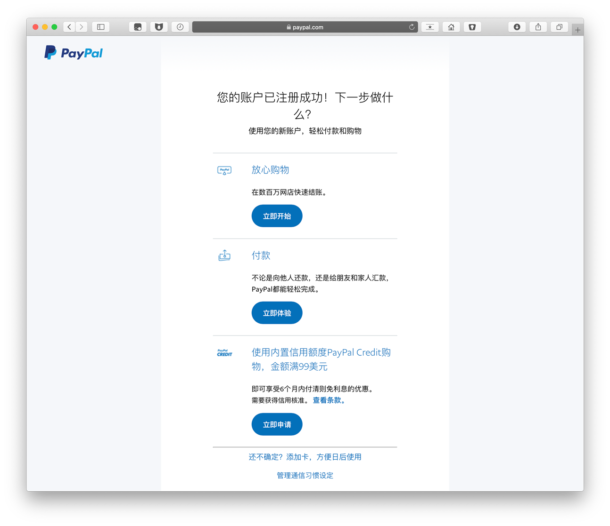
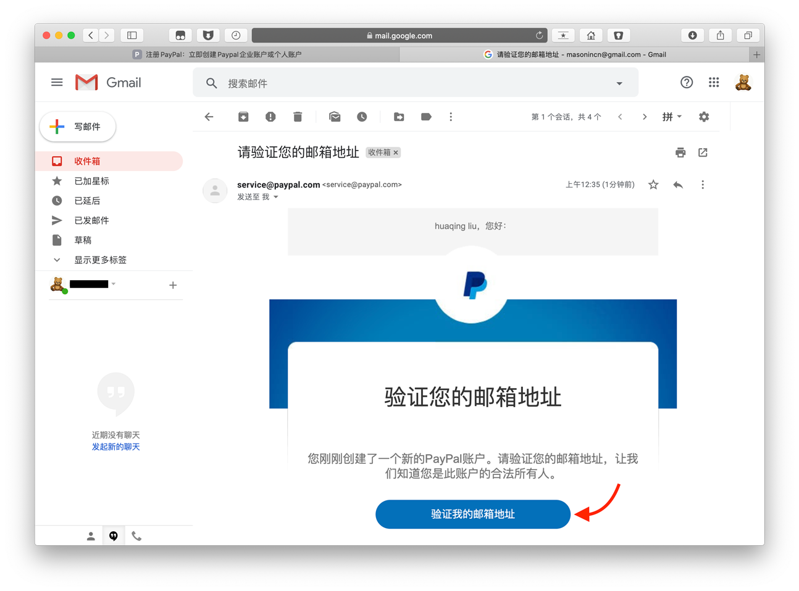
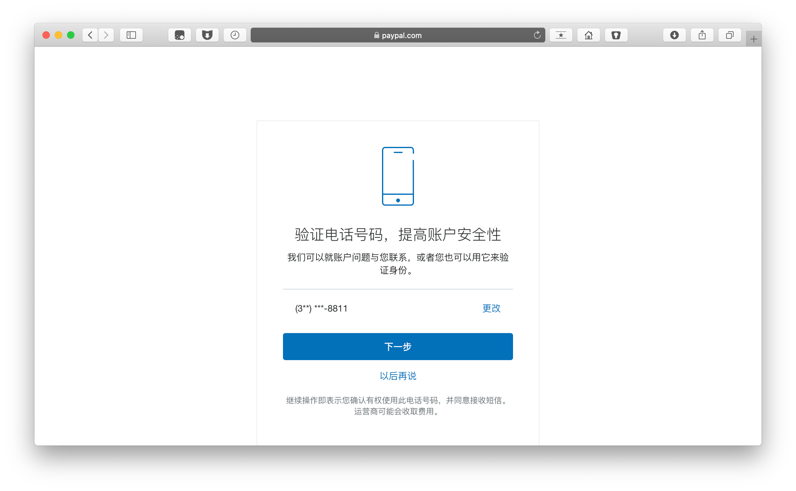
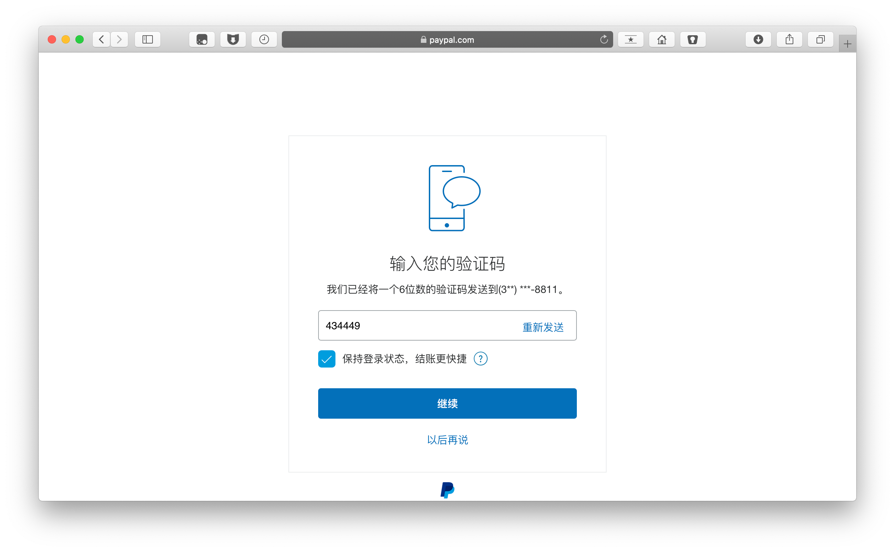
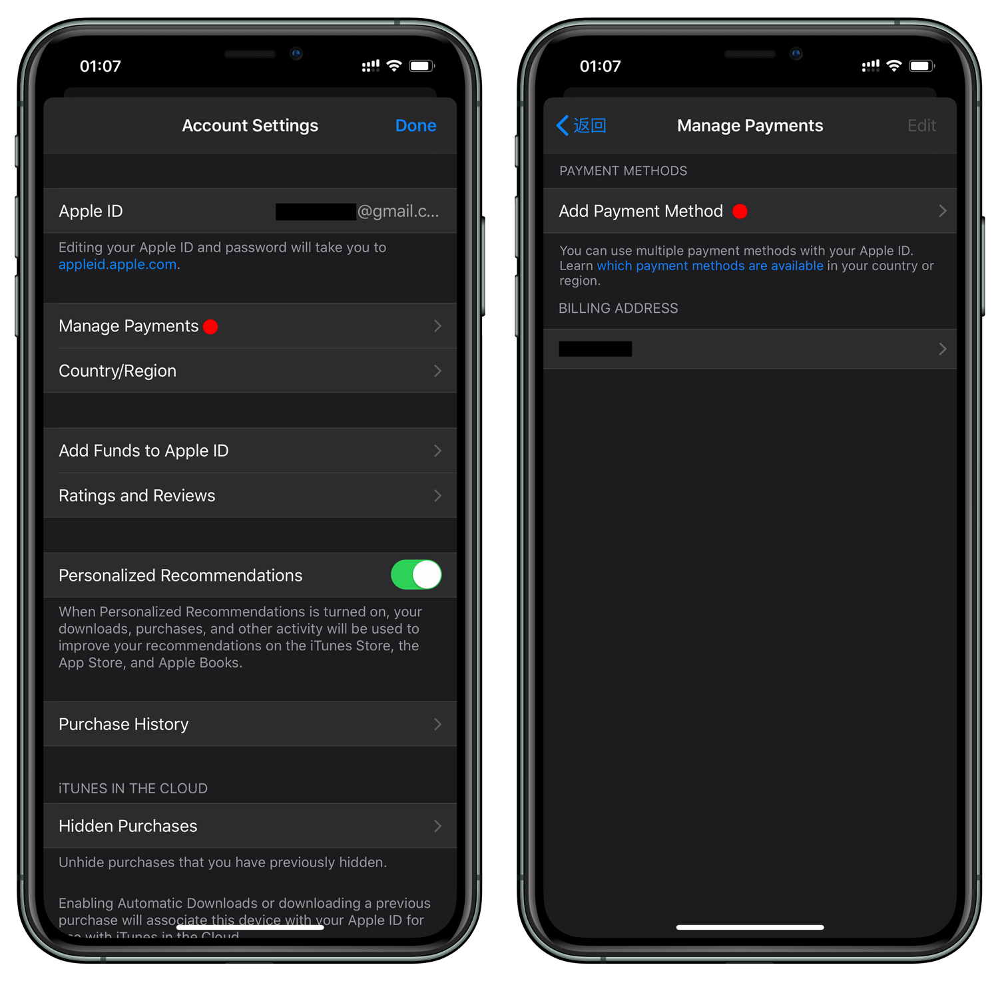
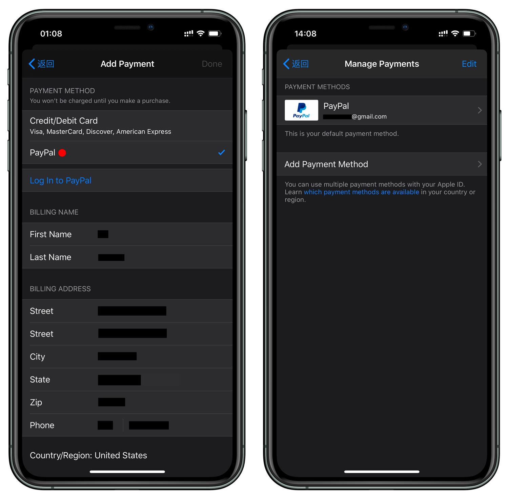

# 使用 Google Voice 注册美区 PayPal，绑定美区 Apple ID 教程

### 步骤一、检查 IP

节点路线切换为美国（全局模式），浏览器（无痕模式）打开 [https://whoer.net](https://whoer.net)，检测路线伪装程度。
> 部分人 IP 节点虽然是美国，但是不是原生 IP

### 步骤二、注册

打开美国 [PayPal](https://www.paypal.com/us/webapps/mpp/home)，点击右上角 `Sign Up` 注册。

选择个人账户，点击「next」。

填写真实姓名、邮箱、密码。

填写美国地址，没有的可以点击 [美国地址生成器](https://www.fakeaddressgenerator.com/Random_Address/US_California)，建议选择免税州。
手机号填写 Google Voice。

* 此时注册完成，但还需要验证邮箱。

### 步骤三、验证邮箱，绑定银行卡

打开 Gmail，收件箱里点击「验证我的邮箱地址」。

填写银行卡信息。

绑定银行卡成功。

### 步骤四、验证手机号完成注册

回到 PayPal 首页，点击「验证我的手机号码」。

输入 Google Voice 号，点击下一步。

* 将收到的验证码填入，点击「继续」。

注册成功。

---

### 步骤五、绑定美区 Apple ID

【注】为防止被[风控](#解决绑定-apple-id-被风控)，建议 2~3 天后再关联美区 Apple ID。

App Store 登陆美区 Apple ID，点按头像进入选择「Manage Payments」管理付款。点按「Add Payment Method」添加付款方式。

选择「PayPal」会自动打开网页并登陆 PayPal 账户。

PayPal 绑定的银行卡会消费几美元，验证成功会返还。

绑定成功，即可购买美区付费 App。

### 解决绑定 Apple ID 被风控
登陆 PayPal 如出现下图情况，是因新注册的 PayPal 有审核机制，解决办法：

**方法一**：将这段话翻译成英文发邮件给 PayPal。

**方法二**：等 1-2 天再来 App Store 验证。

### Telegram
* V2EX群：[https://t.me/V2EXPro](https://t.me/V2EXPro)
* Apple群：[https://t.me/applequn](https://t.me/applequn)
* Google群：[https://t.me/googlequn](https://t.me/googlequn)
